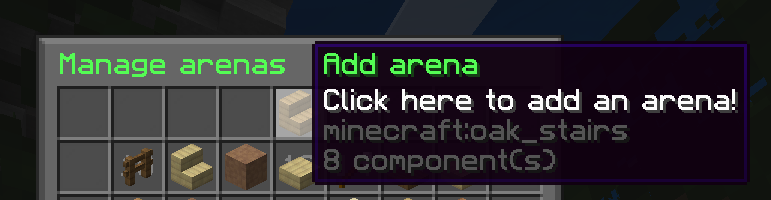
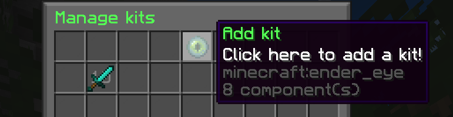
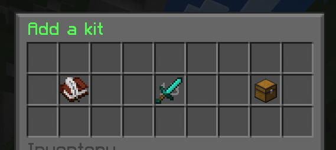
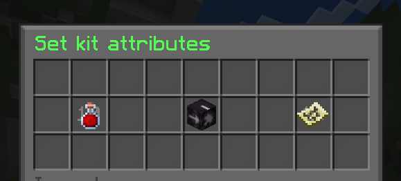

## IMPORTANT! Plugin is WIP


# Duelity is a Duel plugin made for HackClub Carnival, by Polokalap!

## Commands:
### Admin:
- `/#setup` - Set up the server (does literally nothing currently)
- `/#arenas` - Add and manage arenas
- `/#kits` - Add and manage kits
### Player:
- `/duel` - Send a duel invitation to a player
- `/editkit` - Edit a kit's
- `/spectate` - ~~Stalk~~ Spectate other players
- `/leave` - Leave from anything (duel, spectator etc.)

# What is Duelity

Duelity is a Duel plugin for Minecraft paper servers that lets people well... duel!
I have made many duel plugins before, and they were all messy and most importantly, private.
Many of my friends asked me to make them a custom one, but it would've taken too long and I would have got nothing in return, so there isn't much reason for me to do it.
In December 2025, my friend told me about [HackClub Carnival](https://carnival.hackclub.com/), and I felt like I could do this, because so many people requested it and I would get some sort of reward here.
The name came from the CS:2 skin, Duality because I was trying to think of a name and gave it this temporarily and didn't bother to change it.

## Here's a video featuring the plugin:
<p align="center">
  <a href="https://www.youtube.com/watch?v=fkSXEPV_dxI">
    
  </a>
</p>

## How to set up a new arena

### Step 1
Type `/#arenas`, then click the **Add arena** button.  


### Step 2
Paste the schematic of your map **or** build the map, then select the area using the arena wand.

If you deleted it, you can get a new one by typing:
```
/#arenas wand give
```

### Step 3
Set the team spawns by typing:
```
/#arenas set <team color>
```
Team colors are:
- `blue`
- `red`

### Step 4
Set the arena name and icon by typing:
```
/#arenas save <name>
```
Then drop the arena’s icon as an item.

---

## How to set up a kit

### Step 1
Type `/#kits` to open the kit menu, then click the **Add kit** button.  


### Step 2
Set the following variables by clicking the buttons in the menu:
- Name
- Icon
- Items

Then click **Next**.  


### Step 3
Set the remaining variables:
- Health
- Gamemode
- Maps

Then click **Save kit**.  


# Soon to be on Modrinth!

## Required plugins:
- [FAWE](https://modrinth.com/plugin/fastasyncworldedit)
